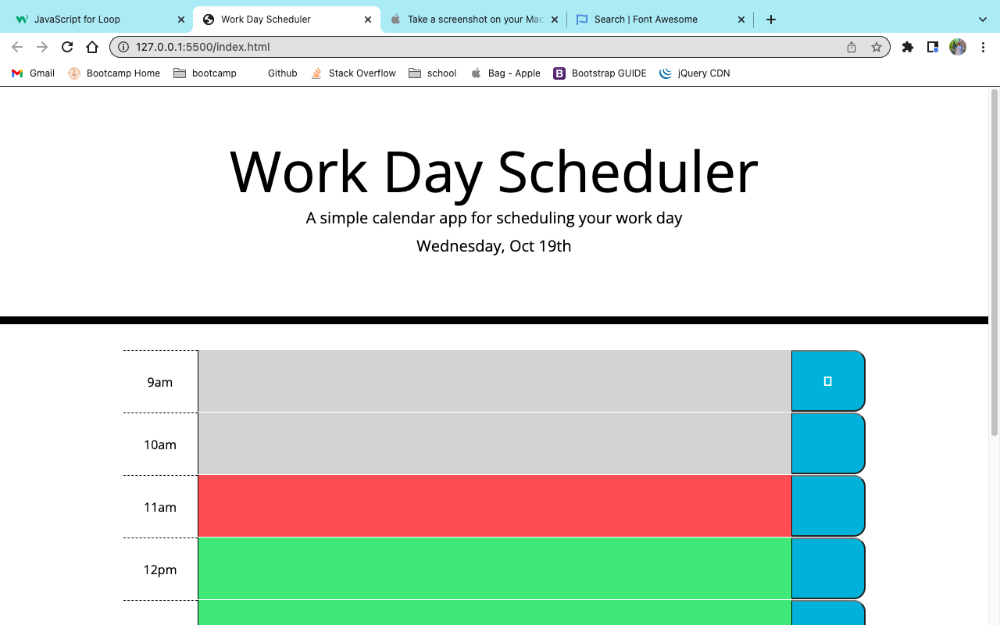
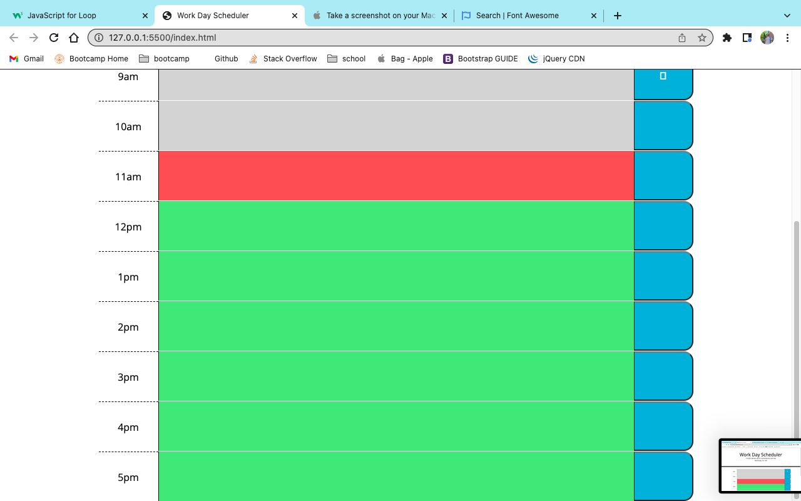

# 05 Third-Party-API Challenge -- Work Day Planner

## Description

**- What was your motivation?**

I was motivated to build this project because it tested my ability to manipulate my application's appearance based on the time-of-day. I knew that this would be difficult, but it was by far the hardest challenge to complete so far. I hit a wall early and backed myself into a corner with a lot of useless, rambling code (I'd describe it as trying to solve an equation by hand with long division, rather than using a calculator). Eventually, I realized that I hadn't planned out my pseudo-code well enough and deleted probably half of my Javascript. I had made many incorrect assumptions about how the problem was 'supposed' to be solved in my mind.

I knew I'd been close for hours and couldn't figure out how to compare the currentHour with the numerical ID's in my index.html. After taking a break (and talking through the problem to my dog Ollie), I sat down and read through the jQuery docs until I found how to use jQuery to store the value of an HTML ID into a JS variable. Finally, everything started to click into place. I'm very happy with my final product, even though I really wanted to include responsive "lock" icons that changed from open to closed when you clicked that save button.

**- What problem does it solve?**

Personally, I struggle with A.D.H.D so this project actually does solve a huge problem for me: time-management. I might even start using this to plan out my daily Bootcamp work. Hopefully I can mold it over time to create a sleek design and more options to better manage my time.

**- What did you learn?**

I learned a lot during this challenge, so I will bullet examples below for the sake of brevity.

- Bootstrap! I'd never used Bootstrap before besides the small bit we covered in class. It's extremely helpful and easy to use, but I'll admit, at first, I started wrapping everything in <divs> and applying the given CSS classes to them instead of the p, textarea, and button. It was a massive waste of time, but hey, now I know.
- JQuery! This was a hard transition for me, especially after last week's challenge. I rewrote SO MUCH code during this challenge because my brain had gotten so used to structuring everything with the vanilla JS web API. It took all day to finally stumble upon the "attribute selector".
- Moment()! I felt very comfortable with Moment.js. I ran into some trouble at first, but I quickly realized I'd simply linked my script.js before the rest of the API script tags, when it should've been placed after them.

## Installation

N/A

## Usage

To find this website, please find my repository named "toliver-workday-scheduler" at https://github.com/tolivercrisp/toliver-workday-scheduler.

## License

The last section of a high-quality README file is the license. This lets other developers know what they can and cannot do with your project. If you need help choosing a license, refer to [https://choosealicense.com/](https://choosealicense.com/).

# Screenshot

Thank you!

